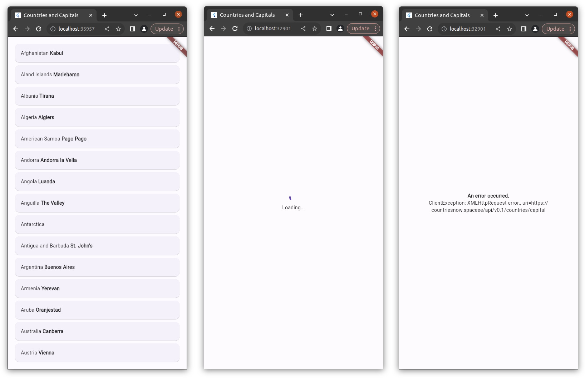

# randstad_flutter_assessment

<b>Randstad's Flutter Assessment.</b>

<h3>Task</h3>
There is an API that returns a list of countries and their capitals.
You have to implement fetching the list of capitals and representing them in a Flutter app.

<h3>API endpoint</h3>
https://countriesnow.space/api/v0.1/countries/capital

<h3>Run the app (Web)</h3>

> flutter run -d chrome

<h3>Run the app (MacOS)</h3>

> flutter run -d macos

<h3>Run tests</h3>

> flutter test

<h3>App Screenshots</h3>

 © Max Shemetov, 2023, MIT License
